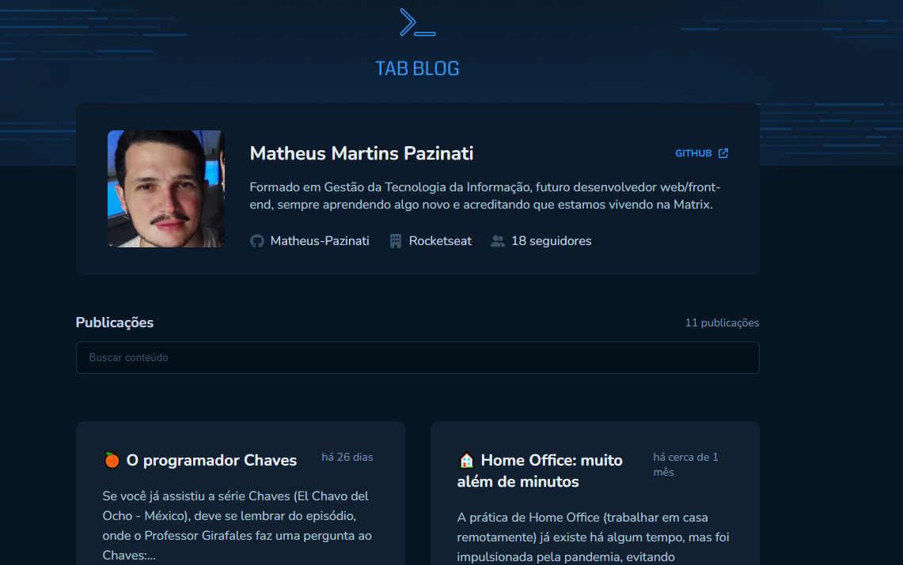

<h1 align="center">Tab Blog 📑</h1>

  

 
<h2>🗃️ Sobre</h2>

Desafio proposto pela Rocketseat durante o Bootcamp Ignite. O Tab Blog é um site que busca e exibe alguns posts e artigos sobre tecnologia e programação que eu escrevi na plataforma TabNews. Além do post, exibe alguns informações adicionais como a quantidade de comentários, TabCoins (similar a Likes de um post do Facebook, por exemplo), data da postagem, etc.

 
<h2>🎯 Objetivo</h2>

O <strong>principal</strong> objetivo ao criar este projeto foi entender na prática como fazer requisições HTTP de uma forma melhor, utilizando a biblioteca React Query para armazenar em cache informações provindas da API que não são atualizadas com frequência (como um post em um blog, por exemplo), ou seja, caso o usuário solicite uma informação repetidas vezes, ao invés de fazer várias chamadas para o Back-end, eu faço apenas uma, armazeno em cache, e nas próximas requisições (durante um determinado tempo estipulado no código) eu retorno as informações que estão em cache, evitando requisições desnecessárias e consequentemente melhorando a performance da aplicação.

 
<h2>🛠️ Tecnologias e ferramentas/bibliotecas utilizadas</h2>
<ul>
  <li><a href="https://pt-br.reactjs.org/">React</a></li>
  <li><a href="https://www.typescriptlang.org/">Typescript</a></li>
  <li><a href="https://styled-components.com/">Styled-Components</a></li>
  <li><a href="https://reactrouter.com/en/main">React Router Dom</a></li>
  <li><a href="https://react-query-v3.tanstack.com/">React Query</a></li>
  <li><a href="https://github.com/remarkjs/react-markdown">React Markdown</a></li>
  <li><a href="https://date-fns.org/">date-fns</a></li>
</ul>
 
 
<h2>🔖 Layout</h2>

Você pode visualizar o layout do projeto através deste link: <a href="https://www.figma.com/file/zVMax10gO3GqHzJWrxUusI/GitHub-Blog-(Community)?node-id=0%3A1">Layout do projeto</a>. É necessário possuir uma conta no <a href="https://figma.com">Figma</a> para acessá-lo.

 
 

Made by Matheus Pazinati 🛸
